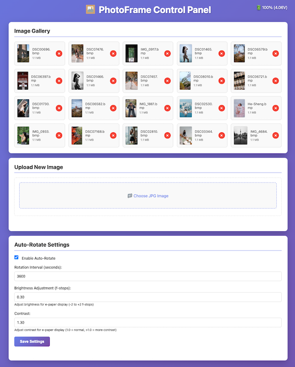

# ESP32-S3 PhotoFrame



A modern, feature-rich firmware for the **Waveshare ESP32-S3-PhotoPainter** that replaces the stock firmware with a powerful RESTful API and web interface. This firmware provides superior image management, automatic rotation handling, drag-and-drop uploads, and intelligent power management.

**Product Page**: [Waveshare ESP32-S3-PhotoPainter](https://www.waveshare.com/wiki/ESP32-S3-PhotoPainter)

## Why This Firmware?

This custom firmware is **better than the stock firmware** because it offers:

- ✅ **Modern Web Interface**: Drag-and-drop image uploads, thumbnail previews, real-time status
- ✅ **RESTful API**: Complete programmatic control for automation and integration
- ✅ **Smart Image Processing**: Automatic portrait rotation, cover-mode scaling, brightness adjustment
- ✅ **JPEG Thumbnails**: Fast-loading gallery with original orientation preserved
- ✅ **Intelligent Power Management**: Auto-sleep with HTTP activity detection
- ✅ **No Manual Conversion**: Upload JPEGs directly - automatic dithering and conversion

## Features

### Image Management
- **Drag & Drop Upload**: Simply drag JPEG files into the browser
- **Smart Resizing**: Client-side scaling to exact display dimensions (800×480 or 480×800)
- **Portrait Detection**: Automatically rotates portrait images for landscape display
- **Thumbnail Gallery**: Fast-loading JPEG thumbnails in original orientation
- **Brightness Adjustment**: 0.3 f-stop increase optimized for e-paper
- **Floyd-Steinberg Dithering**: Professional 7-color palette conversion

### Web Interface
- **Responsive Design**: Works on desktop and mobile browsers
- **Real-time Feedback**: Loading spinners, status messages, progress indicators
- **Concurrent Protection**: Prevents multiple simultaneous display operations
- **Image Preview**: Thumbnails show actual orientation before display

### Power Management
- **Smart Auto-Sleep**: 2-minute timeout with HTTP activity detection
- **Boot Button Wake**: Press to wake and access web interface
- **Sleep Timer Reset**: Any web interaction keeps device awake

## Hardware

**Device**: Waveshare ESP32-S3-PhotoPainter

**Specifications**:
- **MCU**: ESP32-S3-WROOM-1-N16R8 (16MB Flash, 8MB PSRAM)
- **Display**: 7.3" ACeP 7-Color E-Paper (800×480 pixels)
- **Colors**: Black, White, Red, Yellow, Blue, Green, Orange
- **Storage**: MicroSD card slot (supports up to 32GB, FAT32)
- **Power**: AXP2101 PMU, rechargeable battery support
- **Connectivity**: WiFi 802.11 b/g/n (2.4GHz), WPA3-SAE

**Requirements**:
- MicroSD card (formatted as FAT32)
- WiFi network (2.4GHz)
- USB-C cable for programming

## Software Requirements

- ESP-IDF v5.0 or later
- Python 3.7+ (for build tools)
- ESP Component Manager (comes with ESP-IDF)

## Installation

### Option 1: Web Flasher (Easiest) ⚡

**Flash directly from your browser - no software installation required!**

**[🌐 Open Web Flasher](https://aitjcize.github.io/esp32-photoframe/)**

Requirements:
- Chrome, Edge, or Opera browser (Web Serial API support)
- USB-C cable to connect your ESP32-S3-PhotoPainter
- Just click "Connect & Flash" and follow the prompts!

### Option 2: Download Prebuilt Firmware

Download the latest prebuilt firmware from the [GitHub Releases](https://github.com/aitjcize/esp32-photoframe/releases) page:

1. **Quick Flash (Single File):**
   ```bash
   esptool.py --chip esp32s3 --port /dev/ttyUSB0 --baud 921600 write_flash 0x0 photoframe-firmware-merged.bin
   ```

2. **Individual Files:**
   ```bash
   esptool.py --chip esp32s3 --port /dev/ttyUSB0 --baud 921600 \
     write_flash 0x0 bootloader.bin \
     0x8000 partition-table.bin \
     0x10000 photoframe-api.bin
   ```

Replace `/dev/ttyUSB0` with your serial port (e.g., `/dev/cu.usbserial-*` on macOS, `COM3` on Windows).

### Option 3: Build from Source

#### 1. Set up ESP-IDF

```bash
# Source the ESP-IDF environment
cd <path to esp-idf>
. ./export.sh
```

#### 2. Configure the Project

```bash
cd <path to photoframe-api>

# Set target to ESP32-S3
idf.py set-target esp32s3

# Configure project (optional - defaults should work)
idf.py menuconfig
```

#### 3. Build and Flash

The project uses ESP Component Manager to automatically download the `esp_jpeg` component during the first build.

```bash
# Build the project (will download esp_jpeg on first build)
idf.py build

# Flash to device (replace PORT with your serial port, e.g., /dev/cu.usbserial-*)
idf.py -p PORT flash

# Monitor output
idf.py -p PORT monitor
```

**Note:** On the first build, ESP-IDF will automatically download the `esp_jpeg` component from the component registry. This requires an internet connection.

## Initial Setup

### 1. Configure WiFi Credentials

On first boot, the device will start without WiFi connection. You have two options:

**Option A: Modify code before building**
Edit `main/config.h` and set default credentials, or modify `main/main.c` to hardcode your WiFi credentials.

**Option B: Use NVS (recommended for future versions)**
Currently, WiFi credentials need to be set before compilation. A future enhancement could add a WiFi configuration API endpoint.

### 2. Prepare SD Card

1. Format SD card as FAT32
2. The device will automatically create `/sdcard/images/` directory on first boot
3. You can pre-load BMP images (800x480, 7-color palette) into this directory

## Usage

### Web Interface

1. After connecting to WiFi, the device will print its IP address in the serial monitor
2. Open a web browser and navigate to `http://<device-ip>/`
3. The web interface provides:
   - Image gallery with thumbnails
   - Drag-and-drop upload for JPG images
   - Display control and image management
   - Configuration for auto-rotate, brightness, and contrast
   - Real-time battery status

### RESTful API

Complete API documentation is available in **[API.md](API.md)**.

Key endpoints:
- `GET /api/images` - List all images
- `POST /api/upload` - Upload and process JPEG images
- `POST /api/display` - Display an image on e-paper
- `GET /api/config` - Get/set configuration (rotation, brightness, contrast)
- `GET /api/battery` - Get battery status

### Power Management

- **Auto Sleep**: Device enters deep sleep after 2 minutes of inactivity
- **HTTP Activity Detection**: Sleep timer resets on any web interface interaction
- **Wake Up**: Press the boot button (GPIO 0) to wake the device
- **Manual Sleep**: Press the power button (GPIO 5) to immediately enter sleep mode
- **Watchdog Protection**: Prevents crashes during long display operations (40s timeout)

## Configuration Options

Edit `main/config.h` to customize:

```c
#define AUTO_SLEEP_TIMEOUT_SEC      120   // Auto-sleep timeout (2 minutes)
#define IMAGE_ROTATE_INTERVAL_SEC   60    // Default rotation interval
#define DISPLAY_WIDTH               800   // E-paper width
#define DISPLAY_HEIGHT              480   // E-paper height
#define DEFAULT_BRIGHTNESS_FSTOP    0.3   // Default brightness adjustment in f-stops
#define DEFAULT_CONTRAST            1.3   // Default contrast multiplier (1.0 = no change)
```

**HTTP Server Configuration** (`main/http_server.c`):
```c
config.stack_size = 12288;           // 12KB stack per worker thread
config.max_open_sockets = 4;         // Max 4 concurrent connections
```

**Watchdog Configuration** (`sdkconfig.defaults`):
```
CONFIG_ESP_INT_WDT_TIMEOUT_MS=1000   // Interrupt watchdog timeout (1000ms for e-paper SPI)
```

## Image Format

### Supported Input
- **Upload**: JPG/JPEG files (any size, automatically resized to fit display)
- **Direct**: Pre-converted BMP files (800x480, 24-bit RGB)

### Processing Pipeline

**Client-Side (Browser)**:
1. **Orientation Detection**: Determine if image is portrait or landscape
2. **Cover Mode Scaling**: Scale to fill exact display dimensions
   - Landscape: 800×480 pixels
   - Portrait: 480×800 pixels
3. **JPEG Compression**: Compress to 0.9 quality
4. **Upload**: Send to server

**Server-Side (ESP32)**:
1. **JPEG Decoding**: Hardware-accelerated esp_jpeg decoder
2. **Portrait Rotation**: Rotate 90° clockwise if portrait (for display)
3. **Contrast Adjustment**: Apply configurable contrast (default 1.3x, pivots around 128)
4. **Brightness Adjustment**: Apply configurable f-stop adjustment (default +0.3 f-stops)
5. **Floyd-Steinberg Dithering**: Convert to 7-color palette
6. **BMP Output**: Save 800×480 BMP for display
7. **Thumbnail**: Keep original JPEG (480×800 or 800×480) for gallery

### Output Format
- **Display**: BMP, 800x480 pixels, 7-color palette
- **Colors**: Black, White, Yellow, Red, Blue, Green
- **Dithering**: Floyd-Steinberg algorithm for best quality

## Troubleshooting

### WiFi Connection Issues
- Check SSID and password in code
- Ensure 2.4GHz WiFi (ESP32 doesn't support 5GHz)
- Check serial monitor for connection status

### SD Card Not Detected
- Ensure SD card is formatted as FAT32
- Check SD card is properly inserted
- Try a different SD card (some cards are incompatible)

### Image Upload Fails
- Ensure the uploaded file is a valid JPG/JPEG image
- Check available SPIRAM (large images require significant memory)
- Monitor serial output for specific error messages
- If upload succeeds but conversion fails, check SD card space

### Display Not Updating
- Check e-paper connections
- Verify image file exists on SD card
- Check serial monitor for error messages

## Offline Image Processing

Use the Python CLI tool to process images offline with the same pipeline as the ESP32:

```bash
cd process-cli
pip install -r requirements.txt

# Process image with default settings (0.3 f-stop, 1.3 contrast)
./photoframe_process.py input.jpg -o /path/to/sdcard/images/

# Custom brightness and contrast
./photoframe_process.py input.jpg -b 0.5 -c 1.5 -o output/
```

**Output:**
- `photo.bmp` - Processed image for e-paper display
- `photo.jpg` - Thumbnail for web interface

See **[process-cli/README.md](process-cli/README.md)** for detailed usage.

## License

This project is based on the ESP32-S3-PhotoPainter sample code. Please refer to the original project for licensing information.

## Credits

- Original PhotoPainter sample: Waveshare ESP32-S3-PhotoPainter
- E-paper drivers: Waveshare
- ESP-IDF: Espressif Systems

## Support

For issues and questions:
1. Check the troubleshooting section
2. Review serial monitor output for error messages
3. Verify hardware connections
4. Ensure ESP-IDF version compatibility